# Installation and Setup

```admonish
These instructions are for installing Alter Ego using Docker. If you wish not use Docker, please refer
to the [node installation instructions](../appendix/manual_installation/node.md).
```

Installation of Alter Ego is rather complicated, but is made significantly easier with Docker. This page will explain
the process in detail.

## Table of Contents

<!-- toc -->

## Step 0: System Requirements

```admonish
The requirements below are for Linux servers. For system requirements for Windows and Mac, refer to their
respective Docker Desktop [documentation](https://docs.docker.com/desktop/).
```

|              | Minimum        | Recommended    |
|--------------|----------------|----------------|
| Architecture | x86_64 / ARM64 | x86_64 / ARM64 |
| CPUs         | 1              | 2              |
| Memory       | 512 MB         | 2 GB           |
| OS           | Linux          | Linux          |
| Storage      | 10 GB HDD      | 20 GB SSD      |

Although Alter Ego can run on any system that can run Docker, running it on a Linux VPS is recommended, as performance
on Windows and Mac are inferior and can be significantly slower. For instance, the Windows version of Docker relies on
virtualization, and therefore suffers a large performance penalty. Some good VPS providers
include [Hetzner](https://www.hetzner.com/cloud), [DigitalOcean](https://www.digitalocean.com/pricing),
and [Linode](https://www.linode.com/pricing/).

## Step 1: Download Alter Ego

First, you need to download Alter Ego itself. Go to the Alter Ego GitHub page and download the latest release. Click the
releases box and select the newest one (or whichever version you choose).

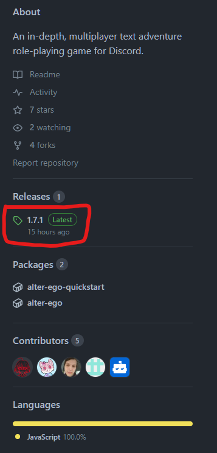

There, you will see something like this.


### Windows, Linux, Mac Desktop

From this page, download the archive `Alter-Ego-[VERSION].tar.gz`. Use your favorite archive utility to open the
archive (e.g. 7zip, GNOME Archive Manager, Keka), and extract the contents into your folder of choice.

### Linux Terminal

Use `wget` to download the archive straight from the terminal. The following is an example (replace VERSION with the
version you want to download).

```shell
wget https://github.com/molsnoo/Alter-Ego/releases/download/[VERSION]/Alter-Ego-[VERSION].tar.gz
```

Unarchive the Alter-Ego folder by running this command (replace VERSION with Alter Ego version).

```shell
tar -xzvf Alter-Ego-[VERSION].tar.gz
```

## Step 2: Install Docker

If you already have Docker installed, you can skip this step.

Docker is a container management platform that allows users to run applications on their machines regardless of
operating system or dependencies. It has very low performance overhead, and provides isolation that improves security.

Although Alter Ego can be installed bare-metal (i.e. without Docker), this is not recommended.

### Linux

To install Docker on your Linux system, refer to the link below:

https://docs.docker.com/engine/install/

Most cloud/VPS providers offer a Docker installation image when you create your VM (e.g. Hetzner).

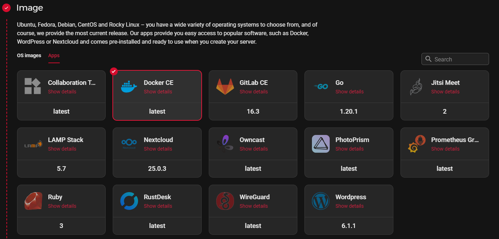

This saves you time and effort from installing docker yourself, and is highly recommended for new users.

### Windows

To install Docker on your Windows system, refer to the link below:

https://docs.docker.com/desktop/install/windows-install/

You can also consult this [YouTube tutorial](https://www.youtube.com/watch?v=aCRMnDLnWmU) for a step-by-step guide.

### Mac

To install Docker on your Mac system, refer to the link below:

https://docs.docker.com/desktop/install/mac-install/

You can also consult this [YouTube tutorial](https://www.youtube.com/watch?v=SGmFGYCuJK4) for a step-by-step guide.

## Step 3: Create a Discord bot

Now that you have Alter Ego installed, you'll need to create a new Discord bot to bind its functionality to. Navigate
to https://discordapp.com/developers/applications/, and once you log in to your Discord account, create a new
application. You can call it whatever you like. This example will use an application called "Test Bot". Once you create
the application, you'll be taken to a page that looks like this:

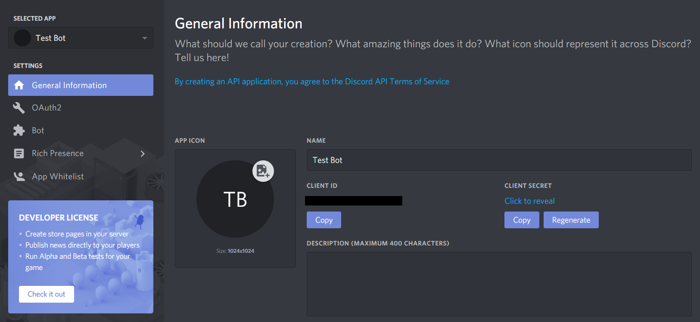

You can ignore this for now. Navigate over to the Bot tab on the left-hand side, then click **Add Bot**. This will bring
you to a page like this:

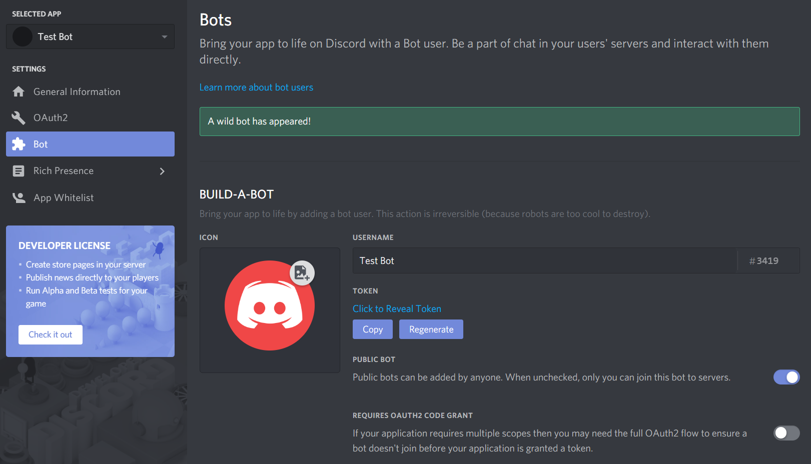

On this page, you can change the bot's name, set its profile picture, and a few other things. _Be sure to uncheck
the **Public Bot** setting! Alter Ego can only be on one server, so you definitely don't want people inviting it to
their own servers!_

In order for Alter Ego to function properly, you _must_ check the three options under the **Privileged Gateway Intents**
section, specifically the **Presence Intent**, **Server Members Intent**, and **Message Content Intent**. If you've done
this right, it will look like this:

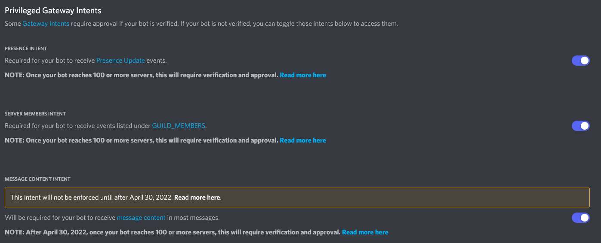

## Step 4: Create a Discord server

Before you can get Alter Ego up and running, you'll have to create a Discord server. You can call it whatever you like,
but once it's made, you'll have to set a number of things up.

The easiest way to create a server is using [this template](https://discord.new/bAA3RcSQPNXj), which will add all of the
requisite roles and channels for you. If you want to set those up manually, refer
to [this page](../appendix/manual_installation/channel_and_role_creation.md).

### Enable Developer Mode

You'll have to enable Developer Mode for your account for the next few steps. To do this, navigate to your User Settings
in Discord. Open the **Appearance** tab and scroll to the bottom. Under **Advanced**, you'll see a switch labeled 
**Developer Mode**. Turn it on if it's not already.

## Step 5: Invite your bot to the server

Back on the Discord Developer Portal, click on the **OAuth2** tab on the left-hand side. Scroll down to this section:

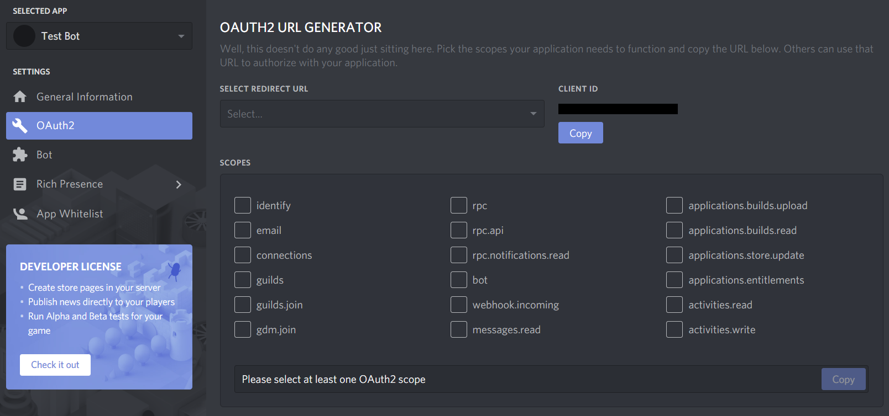

Check **bot**, then in the box that appears below, check **Administrator**. You should have something that looks like
this:

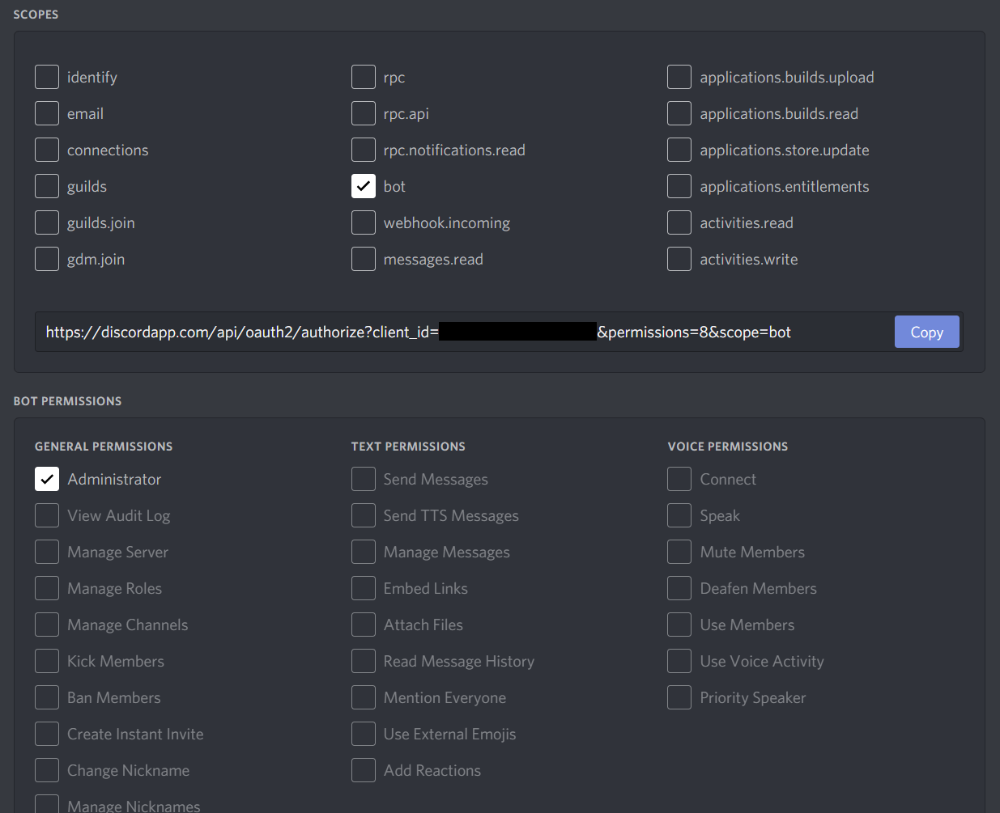

Finally, copy that URL in the **Scopes** box and open it in your browser. It will take you to a page that looks like
this:

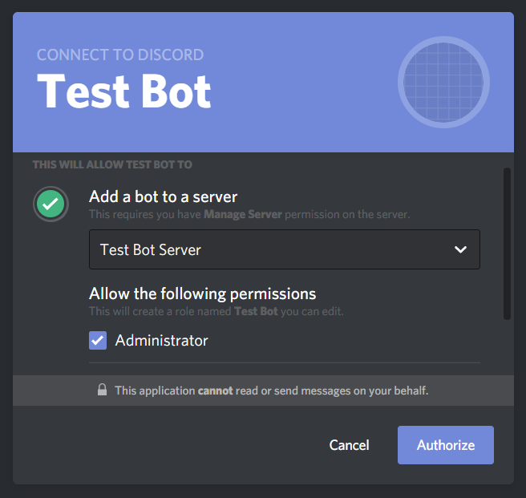

Select the server you just made, make sure **Administrator** is checked, and click **Authorize**.

With that, your bot will join your server! However, it doesn't do anything at the moment. You still need to do a few
things.

## Step 6: Create a spreadsheet

Next, you will need to create a spreadsheet for Alter Ego to use. For more information, see the article
on [spreadsheets](../reference/data_structures/index.md).

## Step 7: Enable the Google Sheets API

In order for Alter Ego to work properly, you will need to create a new Google APIs project. The easiest way to do that
is to navigate to
the [Google Workspace project creation guide](https://developers.google.com/workspace/guides/create-project) and follow
the instructions. For step 5 under the **Enable a Google Workspace API** section, search for **Google Sheets API**.
Assuming you've done this correctly, you should arrive at a page that looks like this:

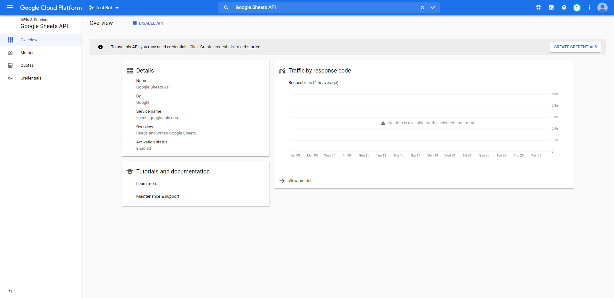

## Step 8: Create a service account

In order to allow Alter Ego to make changes to the spreadsheet, you'll need to create a service account for it to use.
To do that, navigate to the **Credentials** tab on the left-hand side of the page you were just taken to. Click the 
**Create credentials** button and select **Service account**. You should be brought to a page like this:

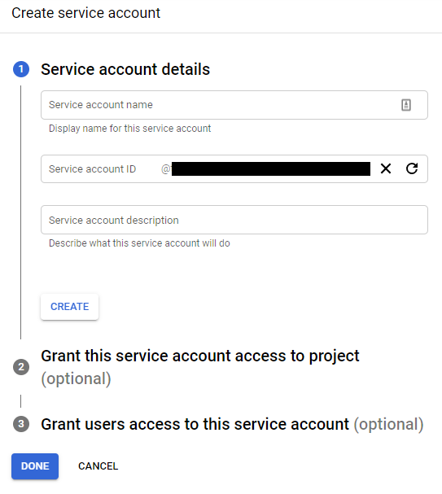

For the name, enter the bot's name; in this case, it's Test Bot. For the description, enter whatever you like. Next,
grant it the "Owner" role. You can skip step 3.

Once your service account is made, you should see it under the **Service Accounts** list. Click on the edit button for
the service account, and then click on the **Keys** tab, so that it brings you to a page like this:

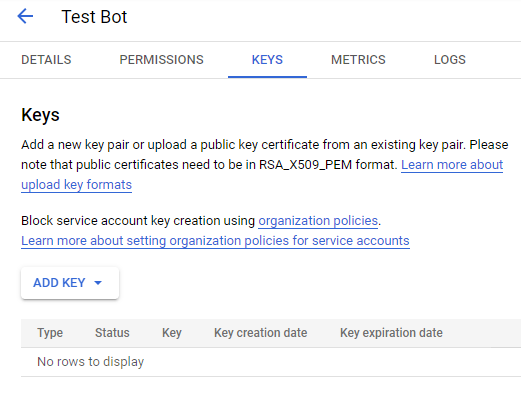

Click the **Add Key** button and select **Create new key**. Make sure the key type is JSON, then click **Create**. This
will download a file to your computer. Don't touch that just yet - there's one thing to do first. Return to the 
**Service Accounts** page.

## Step 9: Share the spreadsheet

On the Service Accounts page, you should now see the service account you just created. Copy its email address, then head
over to the spreadsheet you made earlier.

On the spreadsheet, press the **Share** button. Paste the service account's email address into the dialog box and make
sure to give it permission to edit the spreadsheet. You can also do the same with any other moderators you have, if you
haven't done so already. Once you've done that, you nearly have everything you need.

## Step 10: Edit .env file

The `.env` file is used to change all settings for Alter Ego. Before running Alter Ego, you must change several values
here.

First, open the `Alter-Ego` folder that you downloaded. Then, make a copy of `.env.example` and name it `.env` (note you
may have to set your file browser to show hidden files). On Linux, use these commands.

```shell
cd Alter-Ego
cp .env.example .env
```

Open the `.env` file on your computer. You should see something like this.

```dotenv
# This is an example of an environment file for docker compose.
#
# '#' has been used to comment out any variables that do not need
# to be changed from default. Remove '#' to set them if you want
# to use something other than the default value.
#
# Environment variables should be enclosed in single quotes, and
# should follow the data type next to it (e.g. String).
# For instance: DEBUG_MODE='true'

# Time Zone
# See https://en.wikipedia.org/wiki/List_of_tz_database_time_zones
# for a complete list of timezones.
TZ='America/New_York'

# Credentials
DISCORD_TOKEN=                      # String. Token of discord bot
G_PROJECT_ID=                       # String. Google project ID
G_PRIVATE_KEY_ID=                   # String. Google private key ID
G_PRIVATE_KEY=                      # String. Google private key
G_CLIENT_EMAIL=                     # String. Google client email
G_CLIENT_ID=                        # String. Google client id
G_CLIENT_X509_CERT_URL=             # String. Google cert url

# Settings
SPREADSHEET_ID=                     # String. ID of spreadsheet
...
(file continues on)
```

### Setting Time Zone

Before running Alter Ego, you should set the time zone for your container, so that events in the game sync up to your
location.

Edit the `TZ` line so that it matches the time zone where the game occurs in. For instance, if you want to set the
timezone to London, you would change the line to `TZ='Europe/London'`. For a complete list of timezones, refer to
this [Wikipedia article](https://en.wikipedia.org/wiki/List_of_tz_database_time_zones).

### Setting Credentials

Navigate to the Discord Developer Portal once again and find the application you created earlier. Open the **Bot** tab.
Under **Token**, click **Copy**. Paste it inside the single quotes after `DISCORD_TOKEN=` in your `.env` file. _This
token must not be shared with **anyone**, as it grants access to your bot's account._

Next, open the file you downloaded after creating the service account in any text editor. The file should look something
like this:

```json
{
  "type": "service_account",
  "project_id": "(CONFIDENTIAL)",
  "private_key_id": "(CONFIDENTIAL)",
  "private_key": "(CONFIDENTIAL)",
  "client_email": "(CONFIDENTIAL)",
  "client_id": "(CONFIDENTIAL)",
  "auth_uri": "https://accounts.google.com/o/oauth2/auth",
  "token_uri": "https://oauth2.googleapis.com/token",
  "auth_provider_x509_cert_url": "https://www.googleapis.com/oauth2/v1/certs",
  "client_x509_cert_url": "(CONFIDENTIAL)"
}
```

In case it wasn't clear,
_**almost all of the data in this file is confidential. Don't share it with a single person, and make absolutely sure
not to put it online somehow.**_

Next, add the Google service account credentials to your `.env` file. Copy each corresponding value in the Google
credentials file into your `.env` file. For instance, copy `project_id` into `PROJECT_ID=`. Replace the double quotes in
the original file with single quotes. Don't worry about any values that aren't in the `.env` file, you won't need them.

If you did everything right, the credentials section should look like this:

```dotenv
...
# Credentials
DISCORD_TOKEN='(CONFIDENTIAL)'                      # String. Token of discord bot
G_PROJECT_ID='(CONFIDENTIAL)'                       # String. Google project ID
G_PRIVATE_KEY_ID='(CONFIDENTIAL)'                   # String. Google private key ID
G_PRIVATE_KEY='(CONFIDENTIAL)'                      # String. Google private key
G_CLIENT_EMAIL='(CONFIDENTIAL)'                     # String. Google client email
G_CLIENT_ID='(CONFIDENTIAL)'                        # String. Google client id
G_CLIENT_X509_CERT_URL='(CONFIDENTIAL)'             # String. Google cert url
...
```

### Setting Spreadsheet ID

Finally, you must set the spreadsheet ID. A Google Sheets URL contains two IDs. The first is the ID of the entire
spreadsheet itself. The second is the ID of the individual sheet currently open in the spreadsheet. You can retrieve the
ID of either by copying them from the URL. The format is as follows:

`https://docs.google.com/spreadsheets/d/(entire spreadsheet ID)/edit#gid=(individual sheet ID)`

Copy the ID for the entire spreadsheet and paste it in single quotes after `SPREADSHEET_ID=`. For instance.

```dotenv
SPREADSHEET_ID='1234567890'
```

## (Optional) Fill out other settings

If you wish to change other settings other than the ones outlined above, you can edit their entries in the `.env` file.
Remember to uncomment (i.e. remove the `#` before the line) for them to go into effect. For more information, see the
article on [settings](../reference/settings/docker_settings.md).

## Step 11: Run Alter Ego

Finally, you can run Alter Ego. First, make sure that you are in the directory where Alter Ego is installed.

In a terminal, run:

```shell
docker compose up -d
```

If you did everything right, this is what you'll see:

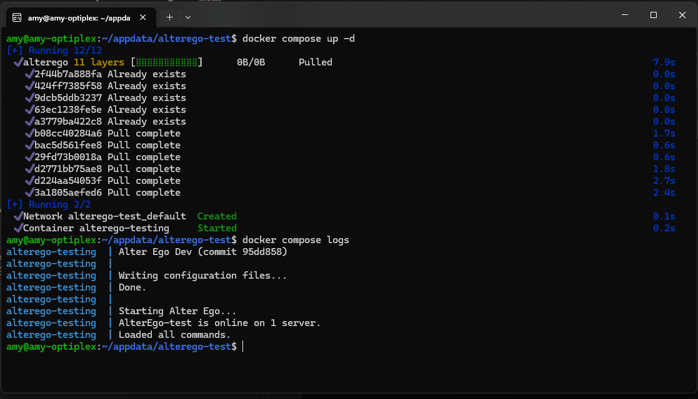

If you run the command `docker compose logs`, you should see this:

```
alterego  | Alter Ego (VERSION) (commit (COMMIT))
alterego  |
alterego  | Writing configuration files...
alterego  | Done.
alterego  |
alterego  | Starting Alter Ego...
alterego  | AlterEgo-test is online on 1 server.
alterego  | Loaded all commands.
```

Congratulations! If everything went well, you can now use Alter Ego to run a game of the Neo World Program. Good luck!

### Updating Alter Ego

To update Alter Ego, first take the container down with this command.

```shell
docker compose down
```

Next, open `docker-compose.yml`. You should see something like this.

```yaml
version: "3.8"

services:
  alterego:
    image: ghcr.io/molsnoo/alter-ego:1.8.0
    container_name: alterego
    env_file:
      - .env
    volumes:
      - data:/home/node/app/Configs
    restart: unless-stopped

volumes:
  data:
```

Then, change the `image:` line so that it corresponds to the new version of Alter Ego. For instance, change `1.8.0` to
`1.9.0`. The line should now read something like this.

```yaml
image: ghcr.io/molsnoo/alter-ego:1.9.0
```

Save the file and quit your text editor.

Next, pull the new update using the following command:

```shell
docker compose pull
```

Finally, simply start the container again and Docker will automatically update Alter Ego for you.

```shell
docker compose up -d
```

### Docker Commands

To view the status of your container run:

```shell
docker ps
```

To view the logs of Alter Ego, run while in the same directory as Alter Ego:

```shell
docker compose logs
```

To stop the container, run:

```shell
docker compose stop
```

To start the container after stopping it, run:

```shell
docker compose start
```

To restart the container, run:

```shell
docker compose restart
```

For a full reference to Docker Compose, refer to the [official documentation](https://docs.docker.com/compose/).
