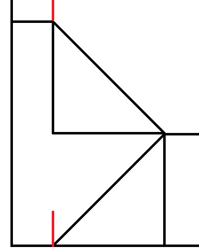

# Player

A Player is a data structure in the Neo World Program. It represents a player that can interact with the game world in a
variety of ways.

There are two types of Players: full Players and NPCs. A full Player is associated with a Discord account, and can be
controlled by that account. An NPC, short for non-player character, can do nearly everything a full Player can do,
however it is not associated with a Discord account; it can only be controlled by a moderator.

It should be noted that when Player data is loaded, so too are [Inventory Items](inventory_item.md). Inventory Items can
be loaded without loading Player data, but not vice versa.

## Attributes

In order to provide a wide array of functionality, Players have many attributes. Note that if an attribute is
_internal_, that means it only exists within
the [Player class](https://github.com/MolSnoo/Alter-Ego/blob/master/Data/Player.js). Internal attributes will be given
in the "Class attribute" bullet point, preceded by their data type. If an attribute is _external_, it only exists on the
spreadsheet. External attributes will be given in the "Spreadsheet label" bullet point.

### ID

- Spreadsheet label: **Discord ID**
- Class attribute: [String](https://developer.mozilla.org/en-US/docs/Web/JavaScript/Reference/Global_Objects/String)
  `this.id`

For full Players, this is the [unique ID](https://discord.js.org/docs/packages/discord.js/main/Snowflake:TypeAlias)
assigned to their Discord account. [Developer Mode](../../moderator_guide/installation.md#enable-developer-mode) must be
enabled in order to obtain this ID by right clicking on a Discord user and selecting **Copy ID**. When Player data is
loaded, Alter Ego will fetch the [guild member](https://discord.js.org/docs/packages/discord.js/main/GuildMember:Class)
whose account has this ID. That Discord user will then be able to control this Player. Because Alter Ego requires guild
member data, this account must belong to a Discord user in the server. If the user associated with a particular Player
leaves the server, Alter Ego will be unable to load that Player's data; they must either be removed from the
spreadsheet, converted to an NPC, or reassigned a different ID.

Because NPCs aren't associated with a Discord account, this attribute is repurposed for them. Instead of a Discord user
ID, this must be an image URL with a `.png` or `.jpg` file extension. This image will be used as the NPC's avatar when
they speak; it will appear in [Room](room.md), [Whisper](whisper.md),
and [spectate channels](player.md#spectate-channel).

### Member

- Class attribute: [GuildMember](https://discord.js.org/docs/packages/discord.js/main/GuildMember:Class) `this.member`

This is an internal attribute which contains a reference to the guild member whose Discord ID matches the Player ID. For
NPCs, this is `null`.

### Name

- Spreadsheet label: **Name**
- Class attribute: [String](https://developer.mozilla.org/en-US/docs/Web/JavaScript/Reference/Global_Objects/String)
  `this.name`

This is the name of the Player. Because this is also used as the name of the Player's spectate channel, it is subject to
Discord's limits on channel names. Only alphanumeric characters (A-Z, a-z, 0-9) and hyphens (-) are permitted; spaces,
symbols, and punctuation are not. This should generally match the Player's nickname on the server, although it doesn't
have to. For that reason, this should be 32 characters or fewer. This conventionally follows naming customs: the first
letter is capitalized, and the rest is in lowercase. However, this is not a requirement.

### Display Name

- Class attribute: [String](https://developer.mozilla.org/en-US/docs/Web/JavaScript/Reference/Global_Objects/String)
  `this.displayName`

This internal attribute is the string which Alter Ego uses to refer to the Player during most gameplay scenarios. It is
used instead of the name in [Narrations](), spectate channels, and more. The reason this is used is that unlike the
Player's name, this can change during gameplay. It is automatically changed when the Player is inflicted with
a [Status Effect](status.md) that has the
[`concealed` behavior attribute](status.md#concealed), and it can be manually changed with
the [setdisplayname](../commands/moderator_commands.md#setdisplayname) [command](../commands/bot_commands.md#setdisplayname).
When Player data is loaded, this is the same as the Player's name. For that reason, moderators should be careful when
loading Player data during gameplay, as any Players with different display names will have their display names reset.

### Display Icon

- Class attribute: [String](https://developer.mozilla.org/en-US/docs/Web/JavaScript/Reference/Global_Objects/String)
  `this.displayIcon`

This is an internal attribute which contains an image URL that will be used as an avatar when the Player uses
the [say](../commands/player_commands.md#say) [command](../commands/moderator_commands.md#say), and when their dialog
appears in a spectate channel. It is also used when NPCs use
the [whisper command](../commands/moderator_commands.md#whisper). For full Players, this is most often `null` -
their [display avatar](https://discord.js.org/docs/packages/discord.js/main/GuildMember:Class#displayAvatarURL) is used
instead. Only NPCs have this set to a non-`null` value by default: the image URL in their ID. Much like the Player's
display name, this can change during gameplay. It is automatically set
to [this image](https://cdn.discordapp.com/attachments/697623260736651335/911381958553128960/questionmark.png) when the
Player is inflicted with a Status Effect that has the `concealed` behavior attribute, and it can be manually changed
with
the [setdisplayicon](../commands/moderator_commands.md#setdisplayicon) [command](../commands/bot_commands.md#setdisplayicon).
However, it should be noted this will **not** replace a full Player's avatar when they speak in a Room or Whisper
channel by sending a message to it; it will only appear in spectate channels when this is the case.

### Talent

- Spreadsheet label: **Talent**
- Class attribute: [String](https://developer.mozilla.org/en-US/docs/Web/JavaScript/Reference/Global_Objects/String)
  `this.talent`

This is primarily a relic from older versions of Alter Ego which used this attribute to produce behavior that has since
been re-implemented using Status Effect behavior attributes. For full Players, this can be left blank without issue.
However, its main benefit is that it can be used as a variable
in [descriptions](../../moderator_guide/writing_descriptions.md#if).

There is one programmed use case for this attribute. If this is set to `NPC`, then the Player will become an NPC. If the
Player has the `NPC` talent, then Alter Ego will not do anything to them that would require a Discord account, such as
sending them DMs, granting/revoking them permission to read channels, and adding/removing roles. NPC Players also will
not be counted in the online Player count, will not be inflicted with or cured of Status Effects when the "all" argument
is used in the [status](status.md) [command](../commands/bot_commands.md#status), and will not be moved when the "all"
argument is used in the [move](../commands/moderator_commands.md#move) [command](../commands/bot_commands.md#move).

### Pronoun String

- Spreadsheet label: **Pronouns**
- Class attribute: [String](https://developer.mozilla.org/en-US/docs/Web/JavaScript/Reference/Global_Objects/String)
  `this.pronounString`

This is a string which determines what set of third person
singular [personal pronouns](https://en.wikipedia.org/wiki/English_personal_pronouns#Basic) will be used to refer to the
Player by default. This must adhere to a strict format:
`subjective/objective/dependent possessive/independent possessive/reflexive/plural`, although there are shorthands for
the three most common pronoun sets:

- `male` is shorthand for `he/him/his/his/himself/false`.
- `female` is shorthand for `she/her/her/hers/herself/false`.
- `neutral` is shorthand for `they/them/their/theirs/themself/true`.

There are several parts to this format. They are as follows:

- The subjective pronoun is used to refer to the Player as the subject of a verb. For example, "**She** speaks."
- The objective pronoun is used to refer to the Player as an object of a verb. For example, "I saw **him**."
- The dependent possessive pronoun is used to refer to the Player as the owner of something which is the object of the
  verb. For example, "That's **their** room."
- The independent possessive pronoun is used to refer to the Player as the owner of something which is the subject of
  the verb. For example, "The car is **hers**."
- The reflexive pronoun is used to refer to the Player when they are the object of a verb where they are also the
  subject. For example, "They wash **themself**."
- The plural variable determines whether this set of pronouns pluralizes verbs. If this is `true`, then verbs will take
  the form they use with plural pronouns. For example, "They **are** here. They **have** money. They **smell** strange."
  If this is `false`, then verbs will take the form they use with singular pronouns. For example, "He **is** here. She
  **has** money. It **smells** strange."

As long as this format is followed, any set of pronouns can be used. For example, a Player who uses _it_ pronouns would
have the pronoun string `it/it/its/its/itself/false`.

A Player cannot have more than one pronoun set at a time. For example, a Player who uses both _he_ and _they_ pronouns
interchangeably can be referred to with _he_ or _they_ by Alter Ego, but not both. It cannot alternate between them at
will. However, this is relatively minor, as Player pronouns are seldom used in built-in Narrations. Descriptions, custom
Narrations, and dialog can all be written with alternating pronouns.

### Original Pronouns

- Class attribute: [object](https://developer.mozilla.org/en-US/docs/Web/JavaScript/Reference/Global_Objects/Object)
  `this.originalPronouns`

This internal attribute is an object containing variables that contain each of the Player's default pronouns. This is
primarily used in response messages in [moderator commands](../commands/moderator_commands.md) and in log messages.

Please see the following class attribute for more info.

### Pronouns

- Class attribute: [object](https://developer.mozilla.org/en-US/docs/Web/JavaScript/Reference/Global_Objects/Object)
  `this.pronouns`

This internal attribute is an object containing variables that contain each of the Player's current pronouns. This is
primarily what is used in Narrations. The reason this is used is that unlike the Player's original pronouns, this can
change during gameplay. It is automatically changed to the `neutral` pronoun set when the Player is inflicted with a
Status Effect that has the `concealed` behavior attribute, and it can be manually changed with
the [setpronouns](../commands/moderator_commands.md#setpronouns) [command](../commands/bot_commands.md#setpronouns).
When Player data is loaded, this is the same as the Player's original pronouns, right down to the structure. For that
reason, moderators should be careful when loading Player data during gameplay, as any Players with pronouns different
from their original pronouns will have their pronouns reset.

This, as well as the original pronouns attribute, has the following structure:

` { String sbj, String Sbj, String obj, String Obj, String dpos, String Dpos, String ipos, String Ipos, String ref, String Ref, Boolean plural }`

This essentially groups what would be multiple class attributes into one. They are listed below:

#### Subjective

- Class attribute: [String](https://developer.mozilla.org/en-US/docs/Web/JavaScript/Reference/Global_Objects/String)
  `this.pronouns.sbj`

This is the Player's subjective pronoun.

#### Capital Subjective

- Class attribute: [String](https://developer.mozilla.org/en-US/docs/Web/JavaScript/Reference/Global_Objects/String)
  `this.pronouns.Sbj`

This is the Player's subjective pronoun, except the first letter is capitalized. This is useful at the beginning of a
sentence when writing descriptions that use the Player's pronouns as variables.

#### Objective

- Class attribute: [String](https://developer.mozilla.org/en-US/docs/Web/JavaScript/Reference/Global_Objects/String)
  `this.pronouns.obj`

This is the Player's objective pronoun.

#### Capital Objective

- Class attribute: [String](https://developer.mozilla.org/en-US/docs/Web/JavaScript/Reference/Global_Objects/String)
  `this.pronouns.Obj`

This is the Player's objective pronoun, except the first letter is capitalized.

#### Dependent Possessive

- Class attribute: [String](https://developer.mozilla.org/en-US/docs/Web/JavaScript/Reference/Global_Objects/String)
  `this.pronouns.dpos`

This is the Player's dependent possessive pronoun.

#### Capital Dependent Possessive

- Class attribute: [String](https://developer.mozilla.org/en-US/docs/Web/JavaScript/Reference/Global_Objects/String)
  `this.pronouns.Dpos`

This is the Player's dependent possessive pronoun, except the first letter is capitalized.

#### Independent Possessive

- Class attribute: [String](https://developer.mozilla.org/en-US/docs/Web/JavaScript/Reference/Global_Objects/String)
  `this.pronouns.ipos`

This is the Player's independent possessive pronoun.

#### Capital Independent Possessive

- Class attribute: [String](https://developer.mozilla.org/en-US/docs/Web/JavaScript/Reference/Global_Objects/String)
  `this.pronouns.Ipos`

This is the Player's independent possessive pronoun, except the first letter is capitalized.

#### Reflexive

- Class attribute: [String](https://developer.mozilla.org/en-US/docs/Web/JavaScript/Reference/Global_Objects/String)
  `this.pronouns.ref`

This is the Player's reflexive pronoun.

#### Capital Reflexive

- Class attribute: [String](https://developer.mozilla.org/en-US/docs/Web/JavaScript/Reference/Global_Objects/String)
  `this.pronouns.Ref`

This is the Player's reflexive pronoun, except the first letter is capitalized.

#### Plural

- Class attribute: [Boolean](https://developer.mozilla.org/en-US/docs/Web/JavaScript/Reference/Global_Objects/Boolean)
  `this.pronouns.plural`

This is a Boolean value indicating whether this pronoun set pluralizes verbs.

### Original Voice String

- Spreadsheet label: **Voice**
- Class attribute: [String](https://developer.mozilla.org/en-US/docs/Web/JavaScript/Reference/Global_Objects/String)
  `this.originalVoiceString`

This is a phrase that will be used in Narrations when the Player speaks while their identity is obscured in some way.
All Narrations which use this are written with the assumption that this string will begin with "a" or "an" and end
with "voice". Here are some examples with the Player's voice string in bold:

- You hear **a bitter voice** in the room say "...What are you looking at?".
- You hear **a brash voice** from a nearby room shout "HEY! IS ANYONE IN THERE!?".
- You overhear an individual wearing a PLAGUE DOCTOR MASK, with **a crisp voice** you recognize to be Kyra's, whisper
  "Yes, everything is going according to plan.".
- **A deep modulated voice** coming from Amy's WALKIE TALKIE says "That is correct. I am hidden somewhere in this
  facility.".

### Voice String

- Class attribute: [String](https://developer.mozilla.org/en-US/docs/Web/JavaScript/Reference/Global_Objects/String)
  `this.voiceString`

This internal attribute contains the Player's current voice descriptor. This is primarily what is used in Narrations.
The reason this is used is that unlike the Player's original voice string, this can change during gameplay. It can be
manually changed with
the [setvoice](../commands/moderator_commands.md#setvoice) [command](../commands/bot_commands.md#setvoice). When Player
data is loaded, this is the same as the Player's original voice string. For that reason, moderators should be careful
when loading Player data during gameplay, as any Players with a voice string different from their original voice string
will have their voice string reset. If the name of another Player, whether living or dead, is supplied, then the Player
will speak using that Player's voice. This will even trick Players with the
[`knows [Player name]` behavior attribute](status.md#knows-player-name) into recognizing this Player's voice as the
mimicked Player.

### Stats

- Spreadsheet label: **Stats**

This is an external attribute. It only exists to group the Player's stats together under one label. A Player's stats are
used in a variety of situations. Common applications of all of them include their ability to
be [modified by Status Effects](status.md#stat-modifiers) and their ability to be used as a modifier
in [Die rolls](die.md). Here, their individual properties and applications will be detailed below.

### Default Strength

- Spreadsheet label: **Str**
- Class attribute: [Number](https://developer.mozilla.org/en-US/docs/Web/JavaScript/Reference/Global_Objects/Number)
  `this.defaultStrength`

This is the Player's default strength stat. This quantifies the Player's physical strength. It must be a whole number
from 1 - 10.

### Strength

- Class attribute: [Number](https://developer.mozilla.org/en-US/docs/Web/JavaScript/Reference/Global_Objects/Number)
  `this.strength`

This internal attribute is the Player's current strength stat. By default, this equals their default strength, however
it can be changed by Status Effects with stat modifiers.

This stat is used to calculate the Player's [maximum carry weight](player.md#max-carry-weight). This value is
recalculated every time the Player's strength stat changes. The formula to calculate the Player's max carry weight in
kilograms is quadratic, not linear. It is roughly based on the range of real human weightlifting capacities. The full
formula, where \\(x\\) is the Player's strength stat, is:

\\[ W_{max} = 1.783x^2 - 2x + 22 \\]

The result is rounded down to the nearest whole number.

In effect, each strength stat value corresponds with a predetermined max carry weight, as shown in this chart:

| Strength Value | Max Carry Weight (kg) | Max Carry Weight (lb) |
| -------------- | --------------------- | --------------------- |
| 1              | 21                    | 46                    |
| 2              | 25                    | 55                    |
| 3              | 32                    | 70                    |
| 4              | 42                    | 92                    |
| 5              | 56                    | 123                   |
| 6              | 74                    | 163                   |
| 7              | 95                    | 209                   |
| 8              | 120                   | 264                   |
| 9              | 148                   | 326                   |
| 10             | 180                   | 396                   |

The strength stat also has special behavior in Die rolls. If a Die is rolled using this Player's strength stat,
the [defender's](die.md#defender) [dexterity](player.md#dexterity) [roll modifier](die.md#stat-roll-modifier)
will be multiplied by \\(-1\\) and added to the Die's modifier. In effect, this factors in the defender's ability to
dodge the Player's attack.

### Default Intelligence

- Spreadsheet label: **Int**
- Class attribute: [Number](https://developer.mozilla.org/en-US/docs/Web/JavaScript/Reference/Global_Objects/Number)
  `this.defaultIntelligence`

This is the Player's default intelligence stat. This quantifies the Player's logical intelligence. It must be a whole
number from 1 - 10.

### Intelligence

- Class attribute: [Number](https://developer.mozilla.org/en-US/docs/Web/JavaScript/Reference/Global_Objects/Number)
  `this.intelligence`

This internal attribute is the Player's current intelligence stat. By default, this equals their default intelligence,
however it can be changed by Status Effects with stat modifiers.

This stat has no programmed use. However, it can be used
in [if conditionals](../../moderator_guide/writing_descriptions.md#if) when writing descriptions to affect what the
Player sees when inspecting various things. For example, a Player with a high intelligence stat may receive more clues
to assist in solving [Puzzles](puzzle.md) and murders than a Player with a low intelligence stat. Whereas a Player with
a low intelligence stat might see this:

`It's a small compartment below the dartboard. Written on it is "Prime x Prime x Prime = 266". There doesn't seem to be any way to open it. Maybe it will open if you hit three prime numbers on the dartboard that multiply together to make 266.`

A Player with an average intelligence stat might see this:

`It's a small compartment below the dartboard. Written on it is "Prime x Prime x Prime = 266". There doesn't seem to be any way to open it. Maybe it will open if you hit three prime numbers on the dartboard that multiply together to make 266. If that's the case, then you know a prime number is a number whose only products are 1 and itself. You don't even have to try any of the double or triple point values, or 50 for that matter.`

And a Player with a high intelligence stat might see this:

`It's a small compartment below the dartboard. Written on it is "Prime x Prime x Prime = 266". There doesn't seem to be any way to open it. Maybe it will open if you hit three prime numbers on the dartboard that multiply together to make 266. If that's the case, then you know a prime number is a number whose only products are 1 and itself. You don't even have to try any of the double or triple point values, or 50 for that matter. The only prime numbers on this board would be 2, 3, 5, 7, 11, 13, 17, and 19. Better yet, 266 is an even number, so you know one of the products MUST be 2, and you only need to find the other two numbers. This should be easy.`

It should be noted that because this stat has no programmed use, it doesn't necessarily have to correlate with the
Player's logical intelligence. It could correlate with the Player's perception, or anything else. How this stat is used
is entirely up to the moderator's discretion when writing descriptions.

### Default Dexterity

- Spreadsheet label: **Dex**
- Class attribute: [Number](https://developer.mozilla.org/en-US/docs/Web/JavaScript/Reference/Global_Objects/Number)
  `this.defaultDexterity`

This is the Player's default dexterity stat. This quantifies the Player's skill and speed when using their hands or
body. It must be a whole number from 1 - 10.

### Dexterity

- Class attribute: [Number](https://developer.mozilla.org/en-US/docs/Web/JavaScript/Reference/Global_Objects/Number)
  `this.dexterity`

This internal attribute is the Player's current dexterity stat. By default, this equals their default dexterity, however
it can be changed by Status Effects with stat modifiers.

This stat is used to determine the Player's probability of success when attempting to
steal [Inventory Items](inventory_item.md) from another Player. When this occurs, a Die is rolled using this Player's
dexterity stat, with the victim as the defender. If the Player has a high dexterity stat, and thus a positive dexterity
roll modifier, then they will be more likely to succeed when attempting to steal. If the Player has a low dexterity
stat, and thus a negative dexterity roll modifier, then they will be more likely to fail when attempting to steal.

It also has special behavior in Die rolls. If a Die is rolled using a different Player's strength stat where this Player
is the defender, this Player's dexterity roll modifier will be multiplied by `-1` and added to the Die's modifier. In
effect, this factors in the Player's ability to dodge the attacker's attack. If the Player has a high dexterity stat,
the attacker will be more likely to have a low attack roll, and vice versa.

### Default Speed

- Spreadsheet label: **Spd**
- Class attribute: [Number](https://developer.mozilla.org/en-US/docs/Web/JavaScript/Reference/Global_Objects/Number)
  `this.defaultSpeed`

This is the Player's default speed stat. This quantifies the Player's walking and running speed. It must be a whole
number from 1 - 10.

### Speed

- Class attribute: [Number](https://developer.mozilla.org/en-US/docs/Web/JavaScript/Reference/Global_Objects/Number)
  `this.speed`

This internal attribute is the Player's current speed stat. By default, this equals their default speed, however it can
be changed by Status Effects with stat modifiers.

This stat is used to calculate the amount of time it takes for the Player to travel from one [Exit](exit.md) to another
in a [Room](room.md).

The flat distance in pixels between the Player's current position and the desired Exit's position is calculated using
the [distance formula](https://en.wikipedia.org/wiki/Euclidean_distance#Two_dimensions) with the two positions'
respective [X](exit.md#x) and [Z](exit.md#z) coordinates. The flat distance is then converted to meters by dividing this
value by the [pixelsPerMeter setting](../settings/docker_settings.md#pixels_per_m). The rise of the Exit's position
relative to the Player's is calculated by subtracting the Player's [Y coordinate](player.md#y)
from [the Exit's](exit.md#y) and dividing the resulting value by the pixels per meter setting. The slope between the two
positions is then calculated by dividing the rise in meters by the flat distance in meters.

Movement speed is roughly based on the range of real human movement speeds. For example, a Player with a speed stat of
10 would have a movement speed of 8.34 meters per second. This is slightly less than Usain Bolt's top sprinting speed of
10.44 meters per second. The base formula to calculate a Player's movement speed in meters per millisecond (m/ms) is
quadratic, not linear. It is as follows:

\\[ R = (0.0183(rx)^2 + 0.005rx + 0.916)w \\]

In this formula are several variables:

- \\(x\\) is the Player's speed stat.
- \\(r\\) is \\(1\\) if the Player is walking and \\(2\\) if the Player is running.
- \\(w\\) is a fraction which represents slowdown based on the [combined weight](player.md#carry-weight) of all of the
  Player's Inventory Items. The formula to calculate this, where \\(c\\) is the Player's carry weight, is \\(w =
  \frac{15}{c}\\). However, the calculated value is clamped between \\( \frac{1}{4} \\) and \\(1\\).

The final rate, \\(R'\\), in meters per millisecond (m/ms), is then calculated with the following formula, where \\(R\\)
is the base rate and \\(s\\) is the slope:

\\[ R' = R - sR \\]

The time it takes to move, \\(t\\), in seconds, is then calculated with the following formula, where \\(d\\) is the flat
distance in meters and \\(R'\\) is the final rate in meters per millisecond:

\\[ t = \frac{d}{R'} * 1000 \\]

However, there is an alternative calculation method. If the flat distance between the Player's position and the Exit's
position is \\(0\\), then the time it takes to move between them is calculated based on the assumption that the Player
is in a stairwell consisting of two horizontally-flipped right triangles with legs of equal length vertically stacked on
top of one another, like this diagram:

Here, the Player is marked by the bottom red line and the Exit is marked by the top red line. They have the same X and Z
coordinates; only their Y coordinates differ. The distance, \\(d\\), in meters between the Player and the Exit is
calculated by using the [Pythagorean theorem](https://en.wikipedia.org/wiki/Pythagorean_theorem) to find the length of
the hypotenuse for each triangle. In this formula, \\(l\\) represents the length of each leg, calculated by dividing the
rise in meters by \\(2\\):

\\[ d = 2 * \sqrt{2l^2} \\]

Then, if the rise is positive, meaning the Player is moving upstairs, the Player's base rate is multiplied by \\(
\frac{2}{3} \\). If the rise is negative, meaning the Player is moving downstairs, the Player's base rate is multiplied
by \\( \frac{4}{3} \\). In effect, their rate is decreased when moving upstairs and increased when moving downstairs.

Finally, the time it takes to move in this scenario, \\(t\\), in seconds, is calculated with the following formula,
where \\(d\\) is the recently determined distance in meters and \\(R\\) is the base rate (without accounting for slope)
in meters per millisecond:

\\[ t = \frac{d}{R} * 2 * 1000 \\]

### Default Stamina

- Spreadsheet label: **Sta**
- Class attribute: [Number](https://developer.mozilla.org/en-US/docs/Web/JavaScript/Reference/Global_Objects/Number)
  `this.defaultStamina`

This is the Player's default speed stat. This quantifies the Player's physical endurance. It must be a whole number from
1 - 10.

### Max Stamina

- Class attribute: [Number](https://developer.mozilla.org/en-US/docs/Web/JavaScript/Reference/Global_Objects/Number)
  `this.maxStamina`

This internal attribute is the Player's current maximum stamina stat. By default, this equals their default stamina,
however it can be changed by Status Effects with stat modifiers.

This stat is used to determine how long the Player can walk or run before being inflicted with the `weary` Status
Effect. The higher this is, the longer the Player can move without resting.

### Stamina

- Class attribute: [Number](https://developer.mozilla.org/en-US/docs/Web/JavaScript/Reference/Global_Objects/Number)
  `this.stamina`

This internal attribute is the Player's current stamina stat. By default, this equals their maximum stamina, however it
changes as the Player moves and rests. Whenever the Player's max stamina changes, so too does their stamina; the ratio
of their current stamina to their max stamina is retained.

As the Player moves, their stamina stat decreases. Every 100 milliseconds, the amount of stamina the Player loses, \\(
L\\), is calculated using the following formula:

\\[ L = dm * (u + su) \\]

In this formula are several variables:

- \\(d\\) is the flat distance in meters the Player has moved in the past 100 milliseconds.
- \\(m\\) is \\(1\\) if the Player is walking and \\(3\\) if the Player is running.
- \\(u\\) is the [staminaUseRate setting](../settings/docker_settings.md#stamina_use_rate).
- \\(s\\) is the slope of the Player's movement, calculated by dividing the number of meters they've risen in meters by
  the flat distance in meters they've moved in the past 100 milliseconds.

However, there is an alternative calculation method. If the flat distance between the Player's position and the Exit's
position is \\(0\\), then the time it takes to move between them is calculated based on the assumption that the Player
is in a stairwell. If the rise is positive, meaning the Player is moving upstairs, the amount of stamina the Player
loses is calculated like so:

\\[ L = 4dmu \\]

If the rise is negative, meaning the Player is moving downstairs, the amount of stamina the Player loses is calculated
like so:

\\[ L = -\frac{dmu}{4} \\]

When the Player's stamina dips below half of their max stamina, they will be sent a warning that they're starting to get
tired. If it reaches \\(0\\), they will stop moving and be inflicted with the `weary` Status Effect.

When the Player is not moving, their stamina is gradually restored. Every 30 seconds, they recover \\( \frac{1}{20} \\)
of their max stamina.

### Alive

- Spreadsheet label: **Alive?**
- Class attribute: [Boolean](https://developer.mozilla.org/en-US/docs/Web/JavaScript/Reference/Global_Objects/Boolean)
  `this.alive`

This indicates whether the player is alive or not. If this is `true`, then the Player is alive, and can interact with
the game world like normally. If this is `false`, then the Player is dead, and they cannot do anything. When a Player
dies, some of their data is lost. In particular, their location, hiding spot, and Status Effects will be lost. However,
they retain everything else, including their Inventory Items. However, because dead Players cannot be inspected or
interacted with, all of their data is inaccessible.

### Location

- Spreadsheet label: **Location**
- Class attribute: [Room](room.md) `this.location`

This is the Room that the Player is currently in. This must match the Room's name exactly on the spreadsheet.

### Position

- Class attribute: [object](https://developer.mozilla.org/en-US/docs/Web/JavaScript/Reference/Global_Objects/Object)
  `this.pos`

This internal attribute is an object containing variables that contain each of the Player's current coordinates. This is
used to calculate the amount of time it will take for the Player to move to an Exit. When the Player is moving, their
position is constantly updated. Every 100 milliseconds, the amount of time that has elapsed since the Player started
moving is taken as a ratio of the total amount of time it will take to move to the desired Exit. Each of the Player's
starting coordinates is subtracted from the Exit's corresponding coordinates, and the resulting value is multiplied by
that ratio and rounded to the nearest whole number. Then, each of these values are added to the Player's starting
coordinates to determined the Player's updated position. This effectively makes it so that if the Player stops moving,
they won't have to move the full distance if they decide to move to that Exit again.

When the Player enters a Room, their position is updated to match the position of the Exit they entered from. However,
if the Player didn't enter from a specific Exit, as would be the case when Player or Room data is loaded or when moving
to a non-adjacent Room, their position is set to the average position of all Exits in the Room.

The Player's position has the following structure:

` { Number x, Number y, Number z }`

This essentially groups what would be multiple class attributes into one. They are listed below:

#### X

- Class attribute: [Number](https://developer.mozilla.org/en-US/docs/Web/JavaScript/Reference/Global_Objects/Number)
  `this.pos.x`

This is the Player's current X coordinate.

#### Y

- Class attribute: [Number](https://developer.mozilla.org/en-US/docs/Web/JavaScript/Reference/Global_Objects/Number)
  `this.pos.y`

This is the Player's current Y coordinate.

#### Z

- Class attribute: [Number](https://developer.mozilla.org/en-US/docs/Web/JavaScript/Reference/Global_Objects/Number)
  `this.pos.z`

This is the Player's current Z coordinate.

### Hiding Spot

- Spreadsheet label: **Hiding Spot**
- Class attribute: [String](https://developer.mozilla.org/en-US/docs/Web/JavaScript/Reference/Global_Objects/String)
  `this.hidingSpot`

This is a string which contains the name of the Object the Player is currently hiding in. Since this is just a string,
it can be set manually on the spreadsheet to anything, whether it's the name of an Object in the Room or not. If the
Player is not currently hidden, this should be left blank.

### Status

- Class
  attribute: [Array](https://developer.mozilla.org/en-US/docs/Web/JavaScript/Reference/Global_Objects/Array)<[Status Effect](status.md)>
  `this.status`

This internal attribute contains a list of all instantiated Status Effects that the Player currently has. Every time a
Status Effect is inflicted or cured, the Player's stats are recalculated.

### Status String

- Spreadsheet label: **Status Effects**
- Class attribute: [String](https://developer.mozilla.org/en-US/docs/Web/JavaScript/Reference/Global_Objects/String)
  `this.statusString`

This string is a comma-separated list of the names of all Status Effects that the Player currently has, including those
that aren't [visible](status.md#visible). If a Status Effect has a [duration](status.md#duration), it can be listed here
by putting the duration in parentheses. The duration must follow a specific format:

`(D) H:mm:ss`

`D` stands for the number of 24-hour days remaining; it is optional. `H` stands for the number of hours remaining. `mm`
stands for the number of minutes remaining; leading zeroes are required. `ss` stands for the number of seconds
remaining; leading zeroes are required. For example, a Status Effect named `famished` with 2 days, 13 hours, 45 minutes,
and 11 seconds remaining would be listed as `famished (2 13:45:11)`. A Status Effect named `clean` with 1 day, 4 hours,
9 minutes, and 7 seconds remaining would be listed as `clean (1 4:09:07)`. A Status Effect named `mortally wounded` with
59 minutes remaining would be listed as `mortally wounded (0:59:00)`.

It should be noted that when entering Status Effects on the spreadsheet manually, it isn't necessary to include the
duration. If the Status Effect has a limited duration, it will automatically have its duration listed on the spreadsheet
when Alter Ego saves the game data. The Player's status string is regenerated with updated durations every second of
gameplay.

### Description

- Spreadsheet label: **Description**
- Class attribute: [String](https://developer.mozilla.org/en-US/docs/Web/JavaScript/Reference/Global_Objects/String)
  `this.description`

This is the description of the Player. When another Player inspects this Player, they will receive a parsed version of
this string. See the article on [writing descriptions](../../moderator_guide/writing_descriptions.md) for more
information.

Player descriptions have a few peculiarities that set them apart from other descriptions, mostly due to the complexity
of Players. In this section, Player descriptions will be explained in full detail.
The [default Player description](../settings/docker_settings.md#default_description) provided in the default
playerdefaults file is:

`<desc><s>You examine <var v="container.displayName" />.</s> <if cond="container.hasAttribute('concealed')"><s><var v="container.pronouns.Sbj" /> <if cond="container.pronouns.plural">are</if><if cond="!container.pronouns.plural">is</if> [HEIGHT], but <var v="container.pronouns.dpos" /> face is concealed.</s></if><if cond="!container.hasAttribute('concealed')"><s><var v="container.pronouns.Sbj" /><if cond="container.pronouns.plural">'re</if><if cond="!container.pronouns.plural">'s</if> [HEIGHT] with [SKIN TONE], [HAIR], and [EYES].</s></if> <s><var v="container.pronouns.Sbj" /> wear<if cond="!container.pronouns.plural">s</if> <il name="equipment"><item>a SHIRT</item>, <item>a pair of PANTS</item>, and <item>a pair of TENNIS SHOES</item></il>.</s> <s>You see <var v="container.pronouns.obj" /> carrying <il name="hands"></il>.</s></desc>`

This description always refers to the Player with the correct name and pronouns according to the situation, and it does
so by making use of the Player's class attributes with `if` and `var` tags. However, unlike descriptions of other data
structures, the class attributes of the Player being described are not being accessed with the typical `this` keyword.
Instead, they are accessed by the `container` keyword. This is done so that the Player can view their own description
when inspecting a MIRROR Object, for example. Because
the [parser module](https://github.com/MolSnoo/Alter-Ego/blob/master/Modules/parser.js) replaces the `this` keyword
in [evaluated](../../moderator_guide/writing_descriptions.md#if) [expressions](../../moderator_guide/writing_descriptions.md#var)
with `container`, the name of the variable referring to the data structure being described, and because the container
variable when a Player inspects a mirror is the MIRROR Object itself, the `this` keyword cannot be used in Player
descriptions while allowing for this functionality. Instead, the `container` keyword must be used, and a MIRROR Object
cannot simply use the Player's description in a variable tag without modifications. It must replace all instances of the
`container` keyword with the `player` keyword, which describes the Player inspecting the MIRROR Object, like so:

`<desc><s>You look at your reflection in the mirror.</s> <var v="player.description.replace(/container./g, 'player.')" /></desc>`

Within the `desc` tags of the Player's description, there are five sections:

- `<s>You examine <var v="container.displayName" />.</s>`
    - This refers to the Player by their current display name. This should never be changed.

- `<if cond="container.hasAttribute('concealed')"><s><var v="container.pronouns.Sbj" /> <if cond="container.pronouns.plural">are</if><if cond="!container.pronouns.plural">is</if> [HEIGHT], but <var v="container.pronouns.dpos" /> face is concealed.</s></if>`
    - This section describes the Player with very little detail in order to avoid revealing their identity when they
      have the `concealed` behavior attribute.
    - The `concealed` behavior attribute automatically changes the Player's pronouns to the `neutral` set. Consequently,
      this section could be written as
      `<if cond="container.hasAttribute('concealed')"><s>They are [HEIGHT], but their face is concealed.</s></if>` for
      simplicity's sake. However, doing so removes the possibility of using the setpronouns command after the Player is
      inflicted with the `concealed` behavior attribute. It can still be used, but the new pronouns will not be
      reflected in the Player's description.

- `<if cond="!container.hasAttribute('concealed')"><s><var v="container.pronouns.Sbj" /><if cond="container.pronouns.plural">'re</if><if cond="!container.pronouns.plural">'s</if> [HEIGHT] with [SKIN TONE], [HAIR], and [EYES].</s></if>`
    - This section describes the Player in more detail. It's used when the Player doesn't have the `concealed` behavior
      attribute.
    - Because the Player's pronouns do not automatically change unless they are inflicted with the `concealed` behavior
      attribute, this section could be written without making use of the Player's pronouns in `var` tags. Instead, the
      Player's pronouns could be written as plain text. This would allow a Player who uses multiple pronouns interchangeably
      to be referred to with alternating pronouns, for example. However, this would hamper the use of the setpronouns
      command for the Player unless additional logic checking is added.
    - In this section, the Player can be described in much more detail than the default description allows for, and detail
      can be added throughout the course of the game if the Player's appearance changes in significant ways. However, Player
      descriptions should ideally be kept as short as possible so as to not overwhelm Players with too much irrelevant
      information.
    - An example of this section that makes use of static pronouns, extra detail, and extra conditionals, might look like
      this:
      `<if cond="!container.hasAttribute('concealed')"><s>It's a fairly young individual of average height with very pale skin.</s> <s>He's quite scrawny and frail-looking, with a very small chest.</s> <s>She has black eyes and short, red hair with bangs falling a little into her face and shoulder-length fringes on both sides, with the rest of its hair <if cond="findInventoryItem('BLAKES RIBBONS', container.name, '', 'HAT') !== undefined">done up in two buns held together with a pair of black ribbons</if><if cond="findInventoryItem('BLAKES RIBBONS', container.name, '', 'HAT') === undefined">coming down to about the shoulders</if>.</s> <s>He looks easy enough to get along with, if a little nervous.</s></if>`

- `<s><var v="container.pronouns.Sbj" /> wear<if cond="!container.pronouns.plural">s</if> <il name="equipment"><item>a SHIRT</item>, <item>a pair of PANTS</item>, and <item>a pair of TENNIS SHOES</item></il>.</s>`
    - This sentence lists all Inventory Items that the Player currently has [equipped](equipment_slot.md), except for those
      equipped to their "RIGHT HAND" and "LEFT HAND" Equipment Slots and those whose Equipment Slot
      is [covered](prefab.md#covered-equipment-slots) by another equipped Inventory Item.
    - If the Player's equipped Inventory Items are manually changed on the spreadsheet, the contents of the `il` tag must be
      manually updated with the [single containing phrases](prefab.md#single-containing-phrase) of the respective Inventory
      Items in `item` tags.
    - If nothing is listed in the `il` tag, this sentence will not appear in the parsed description.
    - Because this sentence appears regardless of whether or not the Player has the `concealed` behavior attribute,
      `var` tags should be used to reference the Player's pronouns. They should not be replaced with static pronouns.

- `<s>You see <var v="container.pronouns.obj" /> carrying <il name="hands"></il>.</s>`
    - This sentence lists all [non-discreet](prefab.md#discreet) Inventory Items that the Player currently has equipped
      to their "RIGHT HAND" or "LEFT HAND" Equipment Slots.
    - If the Player's held Inventory Items are manually changed on the spreadsheet, the contents of the `il` tag must be
      manually updated with the single containing phrases of the respective Inventory Items in `item` tags.
    - If nothing is listed in the `il` tag, this sentence will not appear in the parsed description.
    - Because this sentence appears regardless of whether or not the Player has the `concealed` behavior attribute,
      `var` tags should be used to reference the Player's pronouns. They should not be replaced with static pronouns.

Additional information can be added to the Player's description as needed. However, when doing so, precautions should be
taken to ensure that it does not conflict with the effects of the `concealed` behavior attribute. If additional sections
are added, they generally must use `var` tags to reference the Player's pronouns. A full example of a Player description
with additional detail that makes use of static pronouns where possible might look like this:

`<desc><s>You examine <var v="container.displayName"/>.</s> <if cond="container.hasAttribute('concealed')"><s>They are somewhat tall, but their face is concealed.</s></if><if cond="!container.hasAttribute('concealed')"><s>She's somewhat tall and has a pale complexion.</s> <s>She has long, creamsicle-orange hair with bangs in the middle.</s> <s>She has brown eyes and light brown eyebrows.</s> <s>She has a near-permanent smile, giving you the impression that she's very friendly - perhaps even a bit *too* friendly.</s> <s>She's somewhat thin with a very large chest.</s> <s>All of her fingernails are painted black.</s></if> <s><var v="container.pronouns.Sbj"/> wear<if cond="!container.pronouns.plural">s</if> <il name="equipment"><item>a BLACK HAIRBAND</item>, <item>a WHITE DRESS SHIRT</item>, <item>a BLACK TIE</item>, <item>a BLACK SUIT JACKET</item>, <item>a BLACK PENCIL SKIRT</item>, <item>a set of PANTYHOSE</item>, and <item>a pair of BLACK PUMPS</item></il>.</s> <s>You see <var v="container.pronouns.obj"/> carrying <il name="hands"></il>.</s> <if cond="container.statusString.includes('stinky')"><s><var v="container.pronouns.Sbj"/>'<if cond="container.pronouns.plural">re</if><if cond="!container.pronouns.plural">s</if> a little stinky.</s></if><if cond="container.statusString.includes('rancid')"><s><var v="container.pronouns.Sbj"/> smell<if cond="!container.pronouns.plural">s</if> absolutely **rancid**.</s></if></desc>`

### Inventory

- Class
  attribute: [Array](https://developer.mozilla.org/en-US/docs/Web/JavaScript/Reference/Global_Objects/Array)<[Equipment Slot](equipment_slot.md)>
  `this.inventory`

This internal attribute is a list of Equipment Slots that the Player has. See the article
on [Equipment Slots](equipment_slot.md) for more information.

### Spectate Channel

- Class attribute: [TextChannel](https://discord.js.org/docs/packages/discord.js/main/TextChannel:Class)
  `this.spectateChannel`

This is an internal attribute. When Player data is loaded, Alter Ego will attempt to find the channel in
the [Spectate category](../settings/docker_settings.md#spectate_category) whose name matches the name of the Player. If
it is not found, it will create one with that Player's name. It will not do this if there are already 50 spectate
channels in the Spectate category, however. It also will not attempt to find or create spectate channels for NPCs. In
both scenarios, this is `null`.

A spectate channel replicates the experience of being this Player. Everything the Player sees, including descriptions,
Narrations, dialog, and more, is sent to this channel in chronological order. Here, spectators and dead Players can
watch the game happen in real time, or read it at any point in the future, even after the game has concluded.

There are some things that do not appear in spectate channels, however. Out-Of-Character (OOC) messages - messages that
begin with `(` - are not sent, as
the [dialogHandler module](https://github.com/MolSnoo/Alter-Ego/blob/master/Modules/dialogHandler.js) does not count
these as dialog. The Player's commands are also not sent, nor are error messages about command syntax. When the Player
uses the [status command](../commands/player_commands.md#status), their status will not appear in their spectate
channel.

### Max Carry Weight

- Class attribute: [Number](https://developer.mozilla.org/en-US/docs/Web/JavaScript/Reference/Global_Objects/Number)
  `this.maxCarryWeight`

This internal attribute is the maximum weight the Player can currently carry in kilograms. How it is calculated is
described in more detail in the [strength stat section](player.md#strength). If the Player attempts to take an Item that
is heavier than this number, they will be told it is too heavy to lift, and if the Item is non-discreet, their attempt
to take it will be Narrated in the Room channel. Likewise, if they attempt to take an Item that would make their current
carry weight exceed this value, they will be told that they're carrying too much weight; however, this will not be
Narrated. The same happens if another Player attempts to give this Player an Inventory Item that would exceed this
value. If the Player uses the [dress command](../commands/player_commands.md#dress), they will be unable to dress
themself in any Items that would exceed this value, although they will not be notified of it.

### Carry Weight

- Class attribute: [Number](https://developer.mozilla.org/en-US/docs/Web/JavaScript/Reference/Global_Objects/Number)
  `this.carryWeight`

This internal attribute is the combined [weight](inventory_item.md#weight) of all of the Player's Inventory Items. This
is updated every time the Player's inventory changes. This is used to determine how much slower the Player will
be [when moving](player.md#speed).

### Row

- Class attribute: [Number](https://developer.mozilla.org/en-US/docs/Web/JavaScript/Reference/Global_Objects/Number)
  `this.row`

This is an internal attribute, but it can also be found on the spreadsheet. This is the row number of the Player.

### Is Moving

- Class attribute: [Boolean](https://developer.mozilla.org/en-US/docs/Web/JavaScript/Reference/Global_Objects/Boolean)
  `this.isMoving`

This internal attribute indicates whether the Player is currently in the process of moving or not. If this is `true`,
then they are currently moving. If this is `false`, then they are resting.

It should be noted that the Player can be forcibly stopped from moving in many ways. If Player data is reloaded,
if [edit mode](../../moderator_guide/edit_mode.md) is enabled, if the Player is inflicted with a Status Effect with the
`disable all`, `disable move`, or
`disable run` behavior attributes, if the Player is forcibly moved using moderator or bot commands, or if the Player
dies, they will stop moving, and all class attributes associated with movement will be reset.

### Move Timer

- Class attribute: [Number](https://developer.mozilla.org/en-US/docs/Web/JavaScript/Reference/Global_Objects/Number)
  `this.moveTimer`

This internal attribute uses the [setInterval method](https://developer.mozilla.org/en-US/docs/Web/API/setInterval) to
handle the Player's movement. Every 100 milliseconds, 100 milliseconds are subtracted from the
Player's [remaining time](player.md#remaining-time), and the Player's position and stamina are updated. However, if at
least one Player in the game has the "heated" Status Effect, the amount of milliseconds subtracted from the Player's
remaining time is first multiplied by
the [heatedSlowdownRate setting](../settings/docker_settings.md#heated_slowdown_rate), effectively making the Player
move more slowly. If the Player stops moving for any reason,
the [clearInterval method](https://developer.mozilla.org/en-US/docs/Web/API/clearInterval) is used on this so that the
Player's movement will no longer continue. When Player data is loaded, this is `null`.

### Remaining Time

- Class attribute: [Number](https://developer.mozilla.org/en-US/docs/Web/JavaScript/Reference/Global_Objects/Number)
  `this.remainingTime`

This internal attribute is the number of milliseconds remaining until the Player is done moving to the Exit they're
currently moving to. If the Player stops moving for any reason, this is set to `0`.

### Move Queue

- Class
  attribute: [Array](https://developer.mozilla.org/en-US/docs/Web/JavaScript/Reference/Global_Objects/Array)<[String](https://developer.mozilla.org/en-US/docs/Web/JavaScript/Reference/Global_Objects/String)>
  `this.moveQueue`

This internal attribute is a list of all movements the Player wishes to make in sequential order. When the Player uses
the [move command](../commands/player_commands.md#move) or [run command](../commands/player_commands.md#run), the Exits
they supply as arguments are inserted into this list. Each one is parsed, and if the desired Exit is found, the Player
begins moving to that Exit. When they reach the next Room, the next entry in the queue is parsed and the cycle continues
until the Player reaches the final destination. However, if any entry in the queue is an invalid destination or they
attempt to enter a [locked Exit](exit.md#unlocked), the Player is notified of their mistake, they stop moving, and the
queue is emptied.

This class attribute is unused if the Player is moved with the moderator or bot command, because those commands move the
Player instantaneously. As such, NPCs cannot have queued movements.

### Reached Half Stamina

- Class attribute: [Boolean](https://developer.mozilla.org/en-US/docs/Web/JavaScript/Reference/Global_Objects/Boolean)
  `this.reachedHalfStamina`

This internal attribute indicates whether or not the Player has depleted half of their stamina while moving. When the
Player's stamina first dips below half of their maximum stamina, they will be warned that they're starting to become
tired, and this is set to `true`. Once this is `true`, the warning message is not sent again until Player data is
reloaded, where it is set to `false` by default.

### Interval

- Class attribute: [Number](https://developer.mozilla.org/en-US/docs/Web/JavaScript/Reference/Global_Objects/Number)
  `this.interval`

This internal attribute uses the setInterval method to handle stamina regeneration. Every 30 seconds, Alter Ego checks
if the Player is moving. If they aren't, and if their current stamina is less than their max stamina, they recover
1/20th of their max stamina.

### Online

- Class attribute: [Boolean](https://developer.mozilla.org/en-US/docs/Web/JavaScript/Reference/Global_Objects/Boolean)
  `this.online`

This internal attribute determines whether or not the Player is included in the count of online Players in Alter
Ego's [status message](../settings/docker_settings.md#in_progress_type-in_progress_string). If this is `true`, then the
Player is counted. If this is `false`, then they are not. A Player is set as online whenever they use a command or speak
in-game. NPCs are never considered online.

### Online Interval

- Class attribute: [Number](https://developer.mozilla.org/en-US/docs/Web/JavaScript/Reference/Global_Objects/Number)
  `this.onlineInterval`

This internal attribute uses the [setTimeout method](https://developer.mozilla.org/en-US/docs/Web/API/setTimeout) to
count down until the Player is no longer considered online. Every time the Player is set as online, the online interval
is reset using the [clearTimeout method](https://developer.mozilla.org/en-US/docs/Web/API/clearTimeout) and then
restarted from the beginning. If the timer reaches 0, then the Player is set as offline. This takes 15 minutes. When
Player data is loaded, this is `null`.
