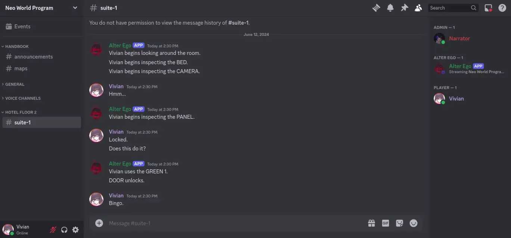
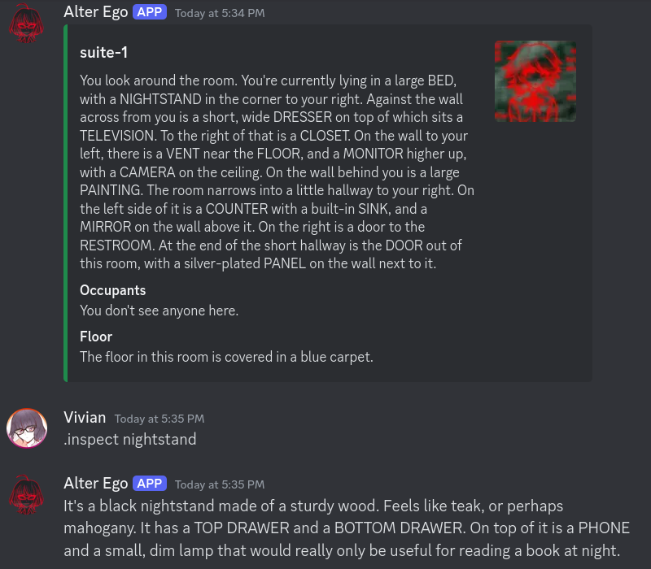
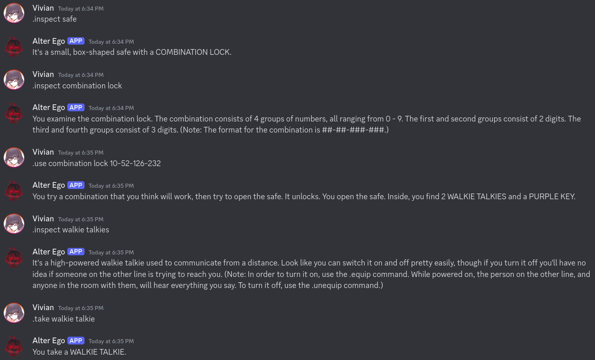
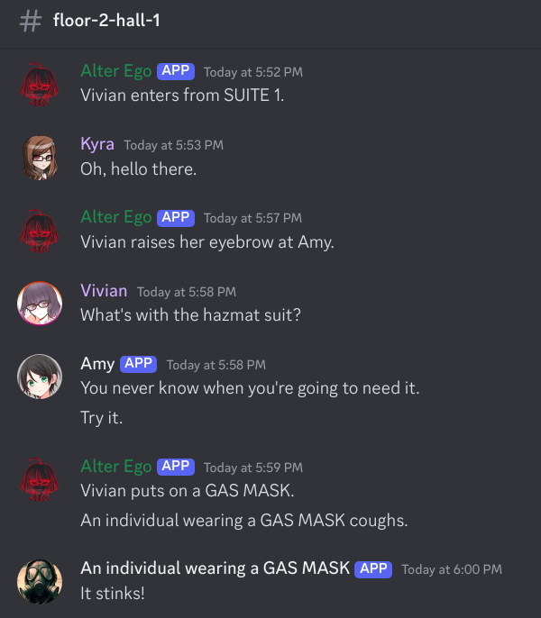
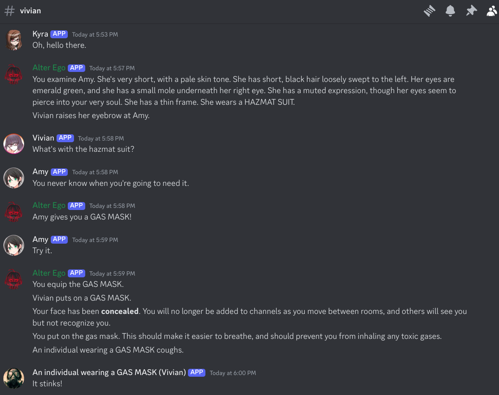

# Alter Ego

Alter Ego is an open-source Discord bot that facilitates an in-depth, multiplayer text adventure role-playing game called the Neo World Program. The gameplay style is heavily influenced by [MUD games](https://en.wikipedia.org/wiki/Multi-user_dungeon). Alter Ego simplifies the game development process by allowing any user to create an immersive game world entirely on Google Sheets with little to no programming knowledge.

For installation, setup, and documentation, check out the [the docs](https://molsnoo.github.io/Alter-Ego).

## Gameplay

The basis of the Neo World Program is moving between rooms. Each room is represented by a Discord channel. When a player moves from one room to another, they will be removed from the room channel they are currently in and added to the channel corresponding to the desired room. Upon entering the new room, they will receive a written description of the room, noting any interesting objects and any other players they find there. In any given room, a player may speak to other players in the room, inspect objects, take and discard items, solve puzzles, whisper to other players, hide in objects to observe the room without being detected, and much more.

Players must all have a separate Discord account, but moderators can add NPCs to the game without one, and have full control over them. Players can interact with each other and NPCs freely. Meanwhile, spectators can watch the game from any player's spectate channel, and see everything that player sees in real time.

The possibilities are endless. To try it for yourself, [install Alter Ego using Docker](https://molsnoo.github.io/Alter-Ego/moderator_guide/installation) and use the `.setupdemo` command to instantly create a small demo environment.

## License

Alter Ego

Copyright (C) <2019> MolSnoo, The Alter Ego Contributors

This program is free software: you can redistribute it and/or modify
it under the terms of the GNU Affero General Public License as
published by the Free Software Foundation, either version 3 of the
License, or (at your option) any later version.

This program is distributed in the hope that it will be useful,
but WITHOUT ANY WARRANTY; without even the implied warranty of
MERCHANTABILITY or FITNESS FOR A PARTICULAR PURPOSE. See the
GNU Affero General Public License for more details.

You should have received a copy of the GNU Affero General Public License
along with this program. If not, see <https://www.gnu.org/licenses/>.
